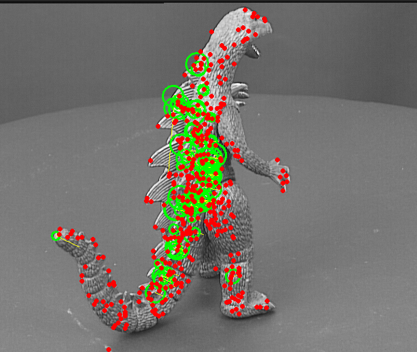
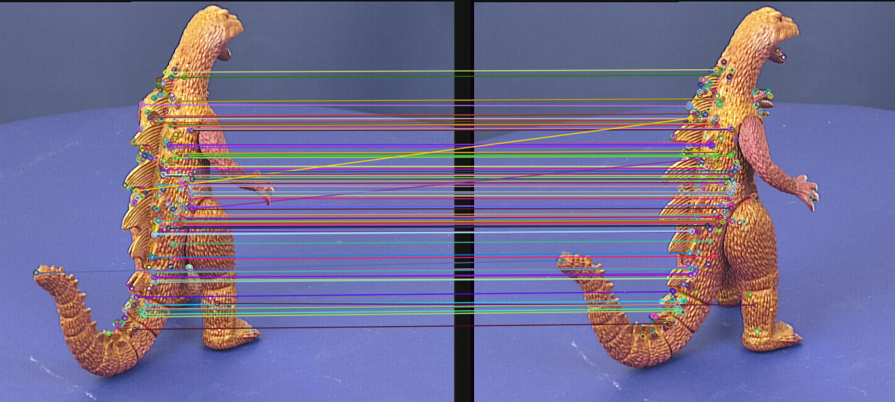
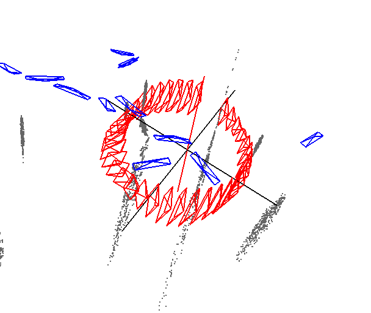

# monocular_slam
sample scripts for monocular slam

# Overview
This script is used to perform monocular visual odometry (VO) using a single camera images. The script takes in a sequence of images and estimates the camera pose relative to the starting position.

# Algorithms
- The script uses ORB (Oriented FAST and Rotated BRIEF) features for image feature detection and matching. 
- The camera pose is estimated using the 5-point algorithm, which is a method for estimating the relative pose between two views of a scene using correspondences between matched features. 
- The camera trajectory is computed by integrating the estimated motion between successive frames.

# Results

